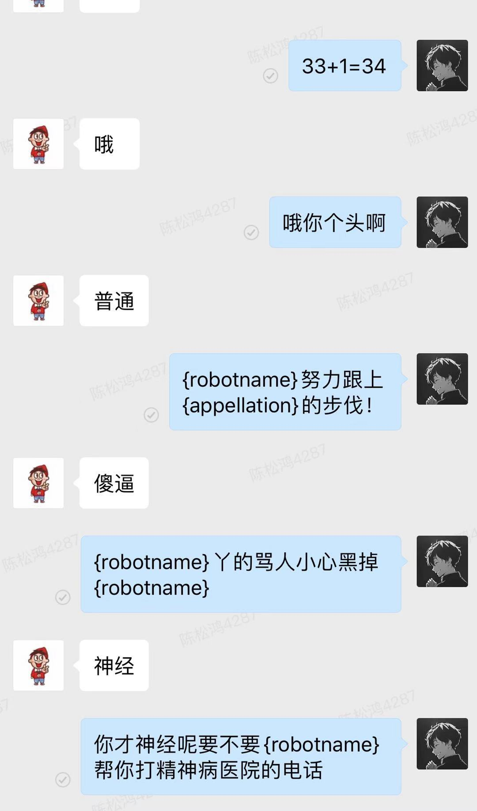

# go_wx_work_bot
企业微信机器人项目

## 项目hook基础源码地址 ：
>https://github.com/smallevilbeast/wxwork_pc_api 

## 原理 
修改原项目的demo示例，通过rabbitmq把收到的消息都投递到rabbitmq中，
再使用golang程序接受并进行对话

## 源码修改后地址 （注有时间可把rabbitmq链接方式修改）
>https://github.com/a1192138141/wxwork_pc_api 
运行方式: python3 samples/python/mq_demo.py

##rabbitmq: 配置修改 （由于最近比较忙没有改成配置文件的形式）
1. python项目中修改 samples/python/rabbitmq.py 第47行为用户名和密码 49行为ip和port
2. golang项目（本项目）的rabbitmq修改 rabbitmq/define 中的ConnUrl 即可 

##关于机器人ai 
采用的是 https://www.tianapi.com/ 中的免费api 每天100次 
可以修改 helper/tianAiApi/中的 KEY 为自己的

##演示 (机器人有点垃圾)
{robotname} 为占位符 有需要可自行更改
自己看看代码吧
